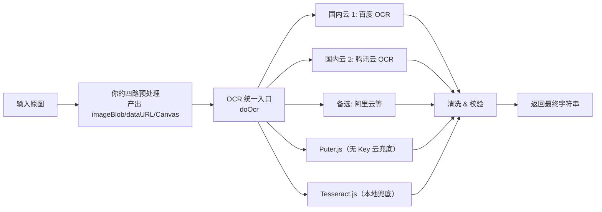

好，这个想法非常对：把 OCR 做成“多路 fallback + 用户自填 Key”的模块，第一道是主流国内云 OCR，第二道是 Puter.js 这类无 Key 云服务，最后一道是本地 Tesseract.js。下面我只给你“OCR 部分”的代码，尽量做到开箱即用，也留好接口让你接上你已有的“四路预处理”。

先给你一个整体结构示意（方便你脑子里有个图）：



下面是直接可拷贝进油猴的“OCR 模块”代码（不包含你已有的预处理部分）：

```javascript
// ==UserScript==
// @name         OCR多路模块（示例片段）
// @namespace    http://tampermonkey.net/
// @version      1.0
// @match        *://*/*
// @require      https://js.puter.com/v2/
// @require      https://unpkg.com/tesseract.js@v5/dist/tesseract.min.js
// @grant        GM_xmlhttpRequest
// ==/UserScript==

(function () {
  'use strict';

  // ================= 配置区：让用户自填 Key =================
  const OCR_CONFIG = {
    // 百度 OCR（推荐）：填 API Key/Secret Key，可选 access_token（脚本会尝试自动获取）
    baidu: {
      apiKey: '',
      secretKey: '',
      accessToken: '', // 可选，留空则脚本自动用 apiKey/secretKey 换取
      // 通用识别接口，可选 general_basic / general_basic_url / accurate_basic
      endpoint: 'https://aip.baidubce.com/rest/2.0/ocr/v1/general_basic',
      // 高精度接口（可选）：
      // endpoint: 'https://aip.baidubce.com/rest/2.0/ocr/v1/accurate_basic',
    },

    // 腾讯云 OCR：填 SecretId/SecretKey
    tencent: {
      secretId: '',
      secretKey: '',
      endpoint: 'https://ocr.tencentcloudapi.com',
      region: 'ap-guangzhou', // 常见：ap-guangzhou / ap-shanghai / ap-beijing
      action: 'GeneralBasicOCR', // 通用印刷体识别
      version: '2018-11-19',
    },

    // 阿里云 OCR：可选，仅作示例；需要 AccessKey ID/Secret，且需云市场签名
    // 鉴权较复杂（需按云市场/POP 签名），下面仅占位，可按需实现
    aliyun: {
      enabled: false,
      accessKeyId: '',
      accessKeySecret: '',
    },

    // 云兜底选项
    puter: {
      enabled: true, // 无 Key 云兜底，建议开启
    },

    tesseract: {
      enabled: true, // 本地兜底，首次会下载语言包，建议开启
      lang: 'eng', // 英文数字验证码建议用 'eng'；中文可用 'chi_sim'
    },
  };

  // ================= 暴露给外部的统一 OCR 入口 =================
  window.MyOcr = {
    /**
     * 统一入口：传入“预处理后”的数据
     * @param {Blob|HTMLCanvasElement|HTMLImageElement|string} input
     *   - Blob / File：直接转 Base64 发送
     *   - Canvas / ImageElement：转 dataURL
     *   - string：若是 dataURL^image/... 直接用；否则按 URL 处理（视后端支持）
     * @param {Object} [options]
     *   - prefer {string[]} 优先顺序，例如 ['baidu','tencent','puter','tesseract']
     *   - timeout {number} 单个接口超时（ms），默认 15000
     * @returns {Promise<string>} 识别到的字符串（失败会抛错）
     */
    async recognize(input, options = {}) {
      const norm = await this._normalizeInput(input);
      const prefer = (options.prefer || ['baidu', 'tencent', 'puter', 'tesseract']).filter(x => this._isEnabled(x));

      // 按顺序尝试，任一成功就返回
      for (const name of prefer) {
        try {
          console.log('[MyOcr] 尝试后端:', name);
          const text = await this._run(name, norm, options);
          if (text && typeof text === 'string') {
            const cleaned = this._clean(text);
            console.log('[MyOcr]', name, '识别结果:', cleaned);
            return cleaned;
          }
        } catch (e) {
          console.warn('[MyOcr]', name, '失败:', e);
        }
      }
      throw new Error('MyOcr: 所有 OCR 通道均失败');
    },

    // 内部：是否启用某个后端
    _isEnabled(name) {
      if (name === 'puter') return OCR_CONFIG.puter.enabled;
      if (name === 'tesseract') return OCR_CONFIG.tesseract.enabled;
      if (name === 'baidu') return !!(OCR_CONFIG.baidu.apiKey && OCR_CONFIG.baidu.secretKey);
      if (name === 'tencent') return !!(OCR_CONFIG.tencent.secretId && OCR_CONFIG.tencent.secretKey);
      if (name === 'aliyun') return OCR_CONFIG.aliyun.enabled;
      return false;
    },

    // 内部：统一输入为 { base64, dataUrl, blob, width, height }
    async _normalizeInput(input) {
      let blob;
      if (input instanceof Blob) {
        blob = input;
      } else if (input instanceof HTMLCanvasElement || input instanceof HTMLImageElement) {
        blob = await new Promise(resolve => {
          if (input instanceof HTMLCanvasElement) {
            input.toBlob(b => resolve(b), 'image/png');
          } else {
            const c = document.createElement('canvas');
            c.width = input.naturalWidth || input.width;
            c.height = input.naturalHeight || input.height;
            c.getContext('2d').drawImage(input, 0, 0);
            c.toBlob(b => resolve(b), 'image/png');
          }
        });
      } else if (typeof input === 'string') {
        if (/^data:image\/[a-zA-Z]+;base64,/.test(input)) {
          const b = await (await fetch(input)).blob();
          blob = b;
        } else {
          // URL：为避免跨域，建议由你这边先转成 Blob/Canvas 再传进来
          throw new Error('MyOcr: 不支持直接传入 URL，请传入 Blob/Canvas/ImageElement/dataURL');
        }
      } else {
        throw new Error('MyOcr: 不支持的 input 类型');
      }

      const dataUrl = await new Promise(resolve => {
        const r = new FileReader();
        r.onload = () => resolve(r.result);
        r.readAsDataURL(blob);
      });

      const img = await new Promise((resolve, reject) => {
        const i = new Image();
        i.onload = () => resolve(i);
        i.onerror = reject;
        i.src = dataUrl;
      });

      return {
        blob,
        dataUrl,
        base64: dataUrl.replace(/^data:image\/[a-zA-Z]+;base64,/, ''),
        width: img.naturalWidth || img.width,
        height: img.naturalHeight || img.height,
      };
    },

    // 内部：分发到具体后端
    async _run(name, norm, options) {
      if (name === 'baidu') return this._baidu(norm, options);
      if (name === 'tencent') return this._tencent(norm, options);
      if (name === 'aliyun') return this._aliyun(norm, options);
      if (name === 'puter') return this._puter(norm, options);
      if (name === 'tesseract') return this._tesseract(norm, options);
      throw new Error('MyOcr: 未知后端 ' + name);
    },

    // ---------------- 各后端实现 ----------------

    // 百度 OCR
    async _baidu(norm, options) {
      const cfg = OCR_CONFIG.baidu;
      const token = cfg.accessToken || await this._getBaiduAccessToken(cfg, options);
      const params = new URLSearchParams();
      // 优先使用 image（Base64）；若需要 URL 模式可改成 url 参数
      params.set('image', norm.base64);

      return new Promise((resolve, reject) => {
        GM_xmlhttpRequest({
          method: 'POST',
          url: cfg.endpoint + '?access_token=' + encodeURIComponent(token),
          data: params.toString(),
          headers: {
            'Content-Type': 'application/x-www-form-urlencoded',
          },
          timeout: options.timeout || 15000,
          onload: (res) => {
            try {
              const obj = JSON.parse(res.responseText);
              if (obj.error_code) {
                const e = new Error('百度 OCR 错误 ' + obj.error_code + ': ' + (obj.error_msg || ''));
                e.code = obj.error_code;
                throw e;
              }
              const words = obj.words_result || [];
              resolve(words.map(w => w.words).join(''));
            } catch (e) {
              reject(e);
            }
          },
          onerror: (err) => reject(new Error('百度 OCR 网络错误')),
          ontimeout: () => reject(new Error('百度 OCR 超时')),
        });
      });
    },

    // 百度：自动获取 access_token（缓存到脚本变量，避免频繁请求）
    _baiduTokenCache: null,
    async _getBaiduAccessToken(cfg, options) {
      if (this._baiduTokenCache) return this._baiduTokenCache;
      const url = 'https://aip.baidubce.com/oauth/2.0/token?grant_type=client_credentials&client_id=' +
        encodeURIComponent(cfg.apiKey) + '&client_secret=' + encodeURIComponent(cfg.secretKey);
      return new Promise((resolve, reject) => {
        GM_xmlhttpRequest({
          method: 'GET',
          url: url,
          timeout: options.timeout || 15000,
          onload: (res) => {
            try {
              const obj = JSON.parse(res.responseText);
              if (obj.error) {
                const e = new Error('百度 token 错误: ' + obj.error_description);
                e.code = obj.error;
                throw e;
              }
              this._baiduTokenCache = obj.access_token;
              resolve(this._baiduTokenCache);
            } catch (e) {
              reject(e);
            }
          },
          onerror: () => reject(new Error('获取百度 access_token 网络失败')),
          ontimeout: () => reject(new Error('获取百度 access_token 超时')),
        });
      });
    },

    // 腾讯云 OCR（需要 v3 签名；这里仅给出调用模板，签名部分建议引入 tc-js-sdk 或按官方算法实现）
    async _tencent(norm, options) {
      const cfg = OCR_CONFIG.tencent;
      // 注意：下面是请求模板，但“签名”建议用官方 SDK：
      //   import TCloud from 'tc-js-sdk'; const client = new TCloud(...); client.request(...)
      // 若你不想引入额外库，需要自己实现 HmacSHA256 + TC3 签名算法
      const payload = {
        ImageBase64: norm.base64,
        // 若你用 URL 模式可改用 ImageUrl
      };
      const body = JSON.stringify({ Action: cfg.action, Version: cfg.version, Region: cfg.region, ...payload });

      return new Promise((resolve, reject) => {
        GM_xmlhttpRequest({
          method: 'POST',
          url: cfg.endpoint,
          data: body,
          headers: {
            'Content-Type': 'application/json',
            // 还需要 X-TC-Action / X-TC-Timestamp / X-TC-Version / Authorization 等
            // 建议用官方 SDK 构造 headers；这里仅做占位
          },
          timeout: options.timeout || 15000,
          onload: (res) => {
            try {
              const obj = JSON.parse(res.responseText);
              if (obj.Response && obj.Response.Error) {
                const e = new Error('腾讯云 OCR 错误: ' + obj.Response.Error.Message);
                e.code = obj.Response.Error.Code;
                throw e;
              }
              // 通用印刷体识别返回在 TextDetections
              const list = obj.Response?.TextDetections || [];
              resolve(list.map(d => d.DetectedText).join(''));
            } catch (e) {
              reject(e);
            }
          },
          onerror: () => reject(new Error('腾讯云 OCR 网络错误')),
          ontimeout: () => reject(new Error('腾讯云 OCR 超时')),
        });
      });
    },

    // 阿里云 OCR：仅占位，云市场 API 需要特定的签名逻辑；可按官方文档实现
    async _aliyun(norm, options) {
      // 若你要实现，可参考：
      //   通用文字识别 / 全文识别高精版 的云市场 API 文档
      throw new Error('阿里云 OCR 未实现（需要云市场/POP 签名）');
    },

    // Puter.js 云 OCR（无 Key，兜底）
    async _puter(norm, options) {
      if (typeof puter === 'undefined' || !puter.ai || !puter.ai.img2txt) {
        throw new Error('Puter.js 未加载，请在脚本头部加上 @require https://js.puter.com/v2/');
      }
      const text = await puter.ai.img2txt(norm.dataUrl); // 官方示例支持 dataURL【turn7fetch0】【turn8find0】
      if (!text || typeof text !== 'string') throw new Error('Puter OCR 返回非字符串');
      return text;
    },

    // Tesseract.js 本地 OCR（兜底）
    async _tesseract(norm, options) {
      if (typeof Tesseract === 'undefined') {
        throw new Error('Tesseract.js 未加载，请在脚本头部加上 @require https://unpkg.com/tesseract.js@v5/dist/tesseract.min.js');
      }
      const { lang = 'eng' } = OCR_CONFIG.tesseract;
      const worker = await Tesseract.createWorker(lang);
      try {
        const ret = await worker.recognize(norm.dataUrl);
        return ret.data.text || '';
      } finally {
        await worker.terminate();
      }
    },

    // 通用后处理：去除常见干扰，保留“字母数字常见字符”
    _clean(raw) {
      if (!raw) return '';
      // 基础清理：去空格/换行
      let s = raw.replace(/[\r\n\s\u3000]+/g, '');
      // 可按你的验证码规则收紧，比如只保留 A-Za-z0-9
      // s = s.replace(/[^A-Za-z0-9]/g, '');
      return s;
    },
  };

  // ================= 简单使用示例（可删除） =================
  // 假设你有一个“四路预处理”函数，把处理好的 Canvas 传给 MyOcr.recognize
  async function demoUseOcr(preprocessedCanvas) {
    try {
      const result = await window.MyOcr.recognize(preprocessedCanvas, {
        prefer: ['baidu', 'tencent', 'puter', 'tesseract'],
        timeout: 12000,
      });
      console.log('[Demo] 最终识别结果:', result);
      return result;
    } catch (e) {
      console.error('[Demo] OCR 失败', e);
      throw e;
    }
  }

  // 你只要把 demoUseOcr 替换为你脚本里实际调用 OCR 的地方即可
})();
```

使用方式（从你的主脚本里）：

- 确保脚本头部的 `@require` 与上面一致（Puter + Tesseract）。
- 把上面的 OCR 模块直接拷贝到你的脚本里（或者拆成单独文件再 `@require`，也可以）。
- 在你现有“四路预处理”得到结果（推荐是 Canvas 或 Blob）后，调用：

```javascript
const code = await window.MyOcr.recognize(yourPreprocessedCanvasOrBlob, {
  prefer: ['baidu', 'tencent', 'puter', 'tesseract'],
  timeout: 12000,
});
// 把 code 填到输入框、提交等
```

关于“国内主流免费 OCR”这块，我选了以下几类作为第一道防线，都是官方明确有免费额度的：

- 百度智能云 OCR：
  - 通用文字识别（含高精）等有免费额度，官方与社区文章普遍提到每月 1000 次免费调用（具体以控制台“免费资源包”为准）【turn0search7】【turn0search9】。
  - 接口示例：通用识别 `https://aip.baidubce.com/rest/2.0/ocr/v1/general_basic?access_token=xxx`；支持 `image`（Base64）与 `url` 两种传图方式【turn1fetch0】。
  - 鉴权：用 API Key + Secret Key 换 `access_token`（OAuth2.0 客户端模式），然后在 OCR 接口 URL 中附上 `access_token`。脚本里已给出自动获取 token 的逻辑。
- 腾讯云 OCR：
  - 通用印刷体识别等多个接口共享 1000 次/月免费额度，每月自动发放【turn0search10】【turn0search15】。
  - 接口域名：`ocr.tencentcloudapi.com`；Action=`GeneralBasicOCR`，Version=`2018-11-19`【turn4find0】【turn4find1】。
  - 鉴权：API 3.0 签名（HmacSHA256），官方提供 Node/Java/Python 等语言的 SDK；油猴里如果不想引入太多依赖，可以最小化实现或干脆把腾讯云作为“可选”通道。
- 阿里云 OCR：
  - 官方免费额度是各接口 200 次/月【turn0search28】。
  - 很多能力在云市场上以“0.01 元/500 次”等方式提供，调用走云市场网关与专用签名逻辑【turn0search22】。
  - 因为鉴权比较重，我在代码里只做了占位；如果你需要，我可以按“云市场版通用文字识别”给你补一个最小化签名实现。

兜底的两路（第二/三道防线）：

- Puter.js：
  - 官方“Free, Unlimited OCR API”教程：浏览器里只要 `https://js.puter.com/v2/`，然后 `await puter.ai.img2txt(dataUrl)` 即可，支持 dataURL，无需后端与 API Key【turn7fetch0】【turn8find0】。
  - 适合作为“无 Key 的云兜底”，但要注意访问速度与稳定性（网络在国外）。
- Tesseract.js：
  - 纯 JS，浏览器端本地 OCR，支持 100+ 语言，CDN 引入即可【turn0search32】【turn9fetch0】。
  - 第一次会从 CDN 下载语言包（几 MB），之后会缓存，适合作为最后的本地兜底。

你已经有“四路预处理”，只需要把预处理结果（Canvas/Blob）传给 `window.MyOcr.recognize(...)` 即可。如果你想要：

- 我帮你把腾讯云那块补上“最小化 v3 签名”实现（这样你在油猴里也能直接用腾讯云而不依赖外部 SDK）；
- 或者为“验证码特定字符集”加更强的后处理规则（比如只保留 A-Z0-9、按长度过滤等）；

告诉我你偏好的优先顺序（比如：百度 > 腾讯 > Puter > Tesseract）和你需要的大致长度/字符集规则，我可以在这份模块里直接把默认 `prefer` 和 `_clean` 按你的场景调优。